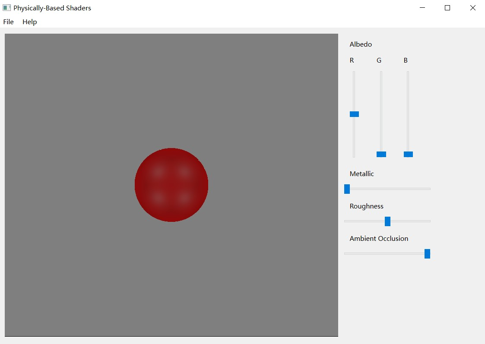
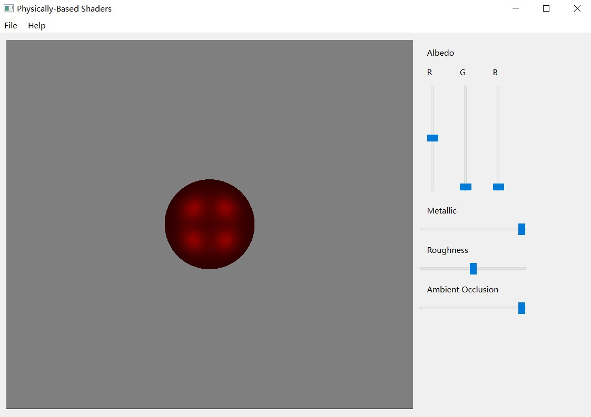
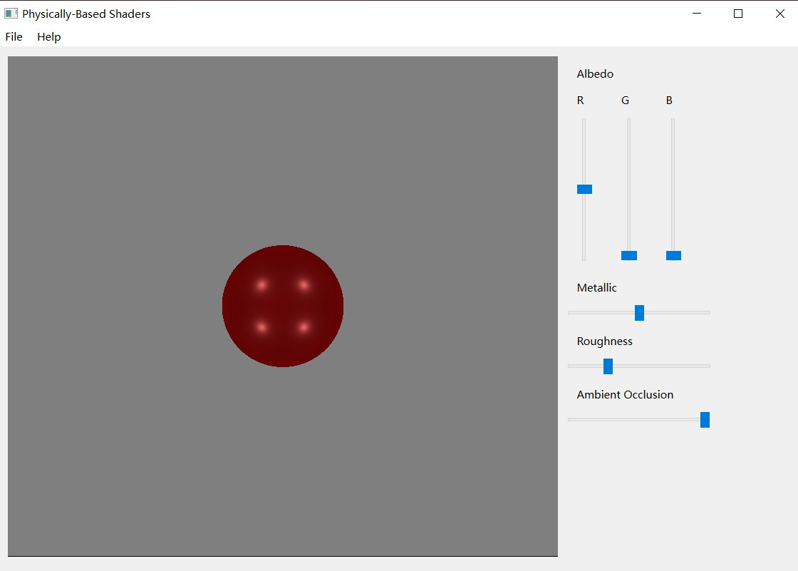

# OpenGL PBR Shader
A Physically-Based Shader 

## Point Light
 - Developed an OpenGL shader for simulating realistic lighting interactions in 3D scenes, focusing on the approximation of the Light Transport Integral with point light sources.
 - Implemented a microfacet Bidirectional Scattering Distribution Function (BSDF) model, allowing for the representation of materials with varying degrees of metallicness and roughness.
 - Programmed the shader to calculate light intensity falloff based on the distance between the light source and the point being illuminated, ensuring accurate light attenuation.
 - Integrated the Cook-Torrance model for glossy reflection and the Lambertian model for diffuse reflection, achieving a physically correct, energy-conserving BSDF.
         

 

 
